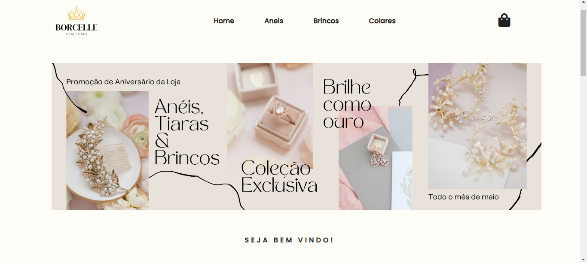

<h1>Loja-Modelo de Ecommerce para WhatsApp</h1>
 

Esse projeto eu desenvolvi pensando em trabalhar com o mercado local proximo da minha casa, utilizei as seguintes tecnologias.

HTM 5, CSS 3, JavaScript, jquery.js, bootstrap.js.

Com essas tecnologias consegui desenvolver um site interativo para Semi-Joias e claro para outros ramos.

 

Ele ficou bem interativo e intuitivo, que leva o cliente direto ao finalizar pedido por WhatsApp.

Ver Projeto <a href="https://gustavomiranda01.github.io/Modelo-Loja-WhatsApp/">Menu-Delivery</a>

